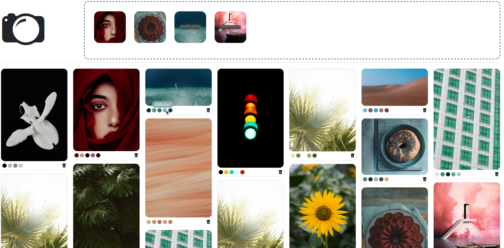

# color-match
A simple flask app that extracts color combinations from a picture with a KMean algorithm



## Description

This app allows you to drop images in a a flask webapp and to find out its color composition. 

* The color composition is calculated with a `KMean` algorithm.
* The webapp is based on `flask`
* The grid system is managed by `Masonry`
* A `mongo` database is used to store the images and their parameters

## Create your .env file

All your settings are stored in that file. Please create a new `.env` file in the `root` folder and edit your variables.

Here is an example of the `.env` file :

```python
# Flask settings
FLASK_PORT=5000
FLASK_HOST = "0.0.0.0"

# Mongo settings
MONGO_HOST = "0.0.0.0"
MONGO_PORT = 27017
MONGO_DATABASE = "colormatch"
MONGO_TABLE = "images"
MONGO_USER = "root"
MONGO_PWD = "example"
```

## Installation with Docker

In this case, you only need `Docker`. The installation process will take place during the build of the container. To build it :

```docker-compose build```

## Run the projet

The container is launched with the following command :

```docker-compose up```

Open your web browser and go to `<FLASK_HOST>:<FLASK_PORT>` to see the flask app. The port is the port of your choice, written in your `.env` file ;)

## Credits

The images in the screenshot are provided by www.unsplash.com.